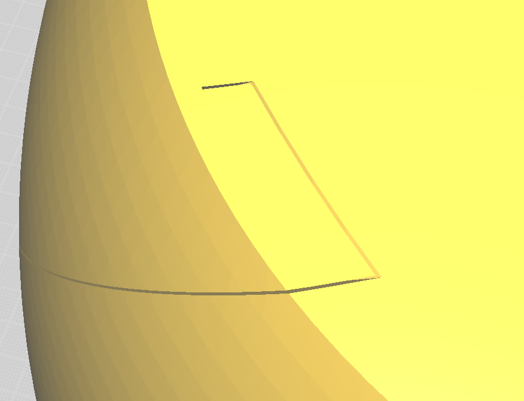
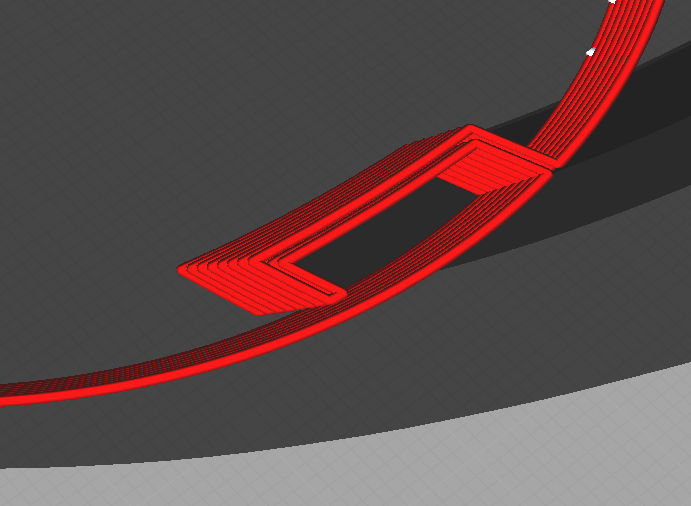

# 3D-Druck - Vase mode mal anders

In einer idealen Welt würden wir das gesamte Ei einfach ganz normal drucken. Leider sagte der Slicer für unsere naive erste Konstruktion eine Druckzeit jenseits von gut und böse voraus. 

Die zweite und entgültige Konstruktion nutzt zwei Tricks um das 32 Zentimeter hohe Ei in etwa einem Tag drucken zu können. 

Der erste Trick ist ein Umstieg auf eine 0.8mm breite Düse. 

Der zweite Trick ist eine kreative Verwendung des Vasenmodus. Auf den ersten Blick scheidet eine Vase aus, da zur Befestigung der LED-stripes ein gewisses Innenleben notwendig ist. 

Wir nutzen hier die Definition einer Vase aus. Der Slicer fährt auf jeder Lage sturr die äußere Kontur ab. "Außere Kontur" ist hier rein mathematisch definiert. Indem wir einen Volumenkörper von außen dünn einschlitzen, können wir also auch im Innenraum des Eis einen Tunnel für die LED-stripes erzeugen. Das ist in den Abbildungen (vase mode 1) und (vase mode 2) illustriert. 

An Boden und Deckel ist der Vasenmodus ungeeignet, da die Überlappung aufeinanderfolgender Lagen bei hier zunehmend klein wird. Daher wird das Ei in drei Teile geteilt, die äußeren beiden drucken wir massiv. Trotz dieser Aufteilung ist das verbliebene Vasenteil recht groß, ein Drucker mit mindestens 250mm Bauraumhöhe ist also Voraussetzung. 

